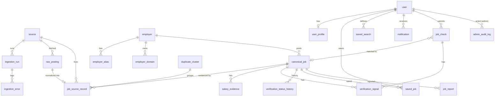

# Data model (MVP)

Every table has `id uuid pk`, `created_at` and `updated_at`. Tables that can hold demo data carry `is_demo boolean not null default false`.

## Key columns

| Table | Notable columns |
|---|---|
| `source` | `type` enum (ATS_PUBLIC_BOARD, EMPLOYER_CAREER_PAGE, GOVERNMENT_OPEN_DATA, LICENSED_FEED, EMPLOYER_SUBMITTED, USER_SUBMITTED_CHECK, DEMO), `provider` (greenhouse/lever/ashby/jobbank/demo), `board_token`, `terms_reference`, `allowed_use`, `rate_limit_per_min`, `enabled`, `last_success_at` |
| `ingestion_run` | `source_id`, `status`, `started_at`, `finished_at`, `fetched`, `upserted`, `errored`, `cursor` |
| `ingestion_error` | `run_id`, `stage` enum (fetch…index), `payload_ref`, `message`, `retry_count`, `dead_lettered_at` |
| `raw_posting` | `source_id`, `external_ref`, `payload jsonb`, `content_hash`, `fetched_at` (unique `source_id, external_ref, content_hash`) |
| `employer` | `display_name`, `legal_name?`, `primary_domain?`, `identity_status` (CONFIRMED/PROBABLE/UNKNOWN), `identity_evidence jsonb`, `registry_ref?` (P1, never faked) |
| `employer_domain` | `employer_id`, `domain`, `kind` (primary/careers/ats_board), `verified_at?`, `evidence_url?` |
| `canonical_job` | `employer_id`, `title`, `title_normalized`, `title_stem`, `city`, `province`, `remote_type`, `employment_type`, `description`, `skills text[]`, `apply_url`, `vacancy_statement?`, `status`, `first_seen_at`, `last_seen_at`, `last_verified_at`, `expired_at?`, `search_tsv tsvector` |
| `job_source_record` | `canonical_job_id`, `source_id`, `raw_posting_id`, `external_ref`, `url`, `apply_url`, own freshness timestamps, `duplicate_cluster_id?`, `match_score?` |
| `salary_evidence` | `canonical_job_id`, `min`, `max`, `currency`, `period`, `type` enum, `source_id`, `evidence_text`, `derived boolean`, `model?`, `observed_at` |
| `verification_signal` | `subject_type` (job/check), `subject_id`, `code`, `polarity`, `weight`, `evidence_text`, `evidence_url?`, `observed_at`, `source_id?`, `superseded_at?` |
| `verification_status_history` | `canonical_job_id`, `from`, `to`, `reason` (rule id or `ADMIN_OVERRIDE`), `actor_user_id?` |
| `duplicate_cluster` | `status` (AUTO_MERGED/REVIEW_REQUIRED/RESOLVED), `score`, `features jsonb` |
| `user` | `email`, `role` (user/admin), **`plan`** (unread by verification, see below) |
| `user_profile` | all fields optional |
| `saved_search` | `user_id`, `filters jsonb` (same Zod schema as the search URL), `last_notified_at` |
| `job_check` | `user_id?`, `session_id?`, `input_url?`, `input_text_encrypted?`, `extracted jsonb`, `matched_canonical_job_id?`, `status`, `expires_at` |
| `job_report` | `canonical_job_id?`, `job_check_id?`, `reason`, `details`, `status` (PENDING/UPHELD/DISMISSED) |
| `admin_audit_log` | `actor_user_id`, `action`, `entity`, `entity_id`, `before jsonb`, `after jsonb` |

## Guardrail: payment isolation
Verification code lives in `src/verification/` and imports only from an allow-listed set of modules and types (`VerificationInput`, which has no `plan`, `sponsored` or billing fields). A lint rule (`no-restricted-imports`) plus a Vitest test that walks the module graph make it fail the build if verification can reach monetization code.
